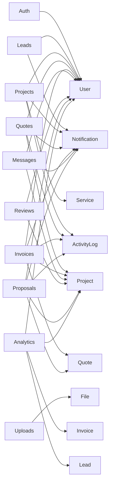
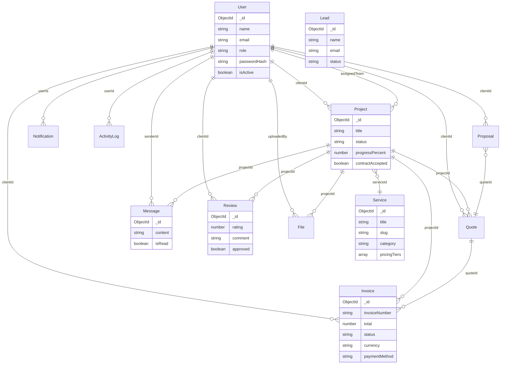

# Invera Backend — Complete Technical Analysis

> **Generated:** July 30, 2026 (Updated: Session 2 — Phase 12: Security hardening + Frontend dashboard)
> **Project:** Invera Digital Agency Backend API
> **Version:** 1.0.0

---

## Table of Contents

- [1. Project Overview](#1-project-overview)
- [2. Architecture](#2-architecture)
- [3. Complete Feature Discovery](#3-complete-feature-discovery)
- [4. API Discovery](#4-api-discovery)
- [5. Database Analysis](#5-database-analysis)
- [6. Authentication & Authorization](#6-authentication--authorization)
- [7. Middleware Analysis](#7-middleware-analysis)
- [8. Validation Rules](#8-validation-rules)
- [9. External Services](#9-external-services)
- [10. Background Processing](#10-background-processing)
- [11. Security Audit](#11-security-audit)
- [12. Performance Review](#12-performance-review)
- [13. Dead Code Detection](#13-dead-code-detection)
- [14. Code Quality Review](#14-code-quality-review)
- [15. Missing Features](#15-missing-features)
- [16. API Documentation](#16-api-documentation)
- [17. Developer Documentation](#17-developer-documentation)
- [18. Improvement Roadmap](#18-improvement-roadmap)
- [19. Final Summary](#19-final-summary)

---

## 1. Project Overview

| Attribute | Value |
|---|---|
| **Language** | TypeScript (Node.js) |
| **Framework** | Express.js 4.18 |
| **Architecture** | Modular MVC (Controller-Service-Model) |
| **Database** | MongoDB via Mongoose 8 |
| **Auth** | JWT (access + refresh tokens), bcryptjs |
| **Validation** | Zod 3.22 |
| **File Upload** | Multer (disk storage) |
| **Payments** | Stripe (partial), bKash/Nagad (manual confirmation) |
| **PDF Generation** | pdf-lib |
| **Email** | Nodemailer (configured but **unused in code**) |
| **Media** | Cloudinary (configured but **unused in code**) |
| **Security** | Helmet, CORS, express-rate-limit |
| **Logging** | Morgan |

### Entry Point

`src/index.ts` — initializes Express, connects middleware, mounts 17 route modules, starts server on configurable port.

### Configuration Files

| File | Purpose |
|---|---|
| `.env` / `.env.example` | Environment variables |
| `tsconfig.json` | TypeScript config with path alias `@/*` |
| `package.json` | Scripts: `dev`, `build`, `start`, `lint`, `typecheck` |

### Folder Structure

```
src/
├── index.ts                   # Entry point
├── config/
│   ├── env.ts                 # Environment variable loader
│   ├── db.ts                  # MongoDB connection
│   └── brand.ts               # Brand constants
├── middleware/
│   ├── authGuard.ts           # JWT authentication (super_admin bypass)
│   ├── roleGuard.ts           # Role-based authorization (super_admin bypass)
│   ├── permissionGuard.ts     # Dynamic permission-based authorization
│   ├── validate.ts            # Zod schema validation
│   └── errorHandler.ts        # Centralized error handler
├── services/
│   └── email.service.ts       # Nodemailer email service (OTP, invoices, welcome)
├── utils/
│   ├── apiResponse.ts         # sendSuccess / sendError helpers
│   └── token.ts               # Refresh token hashing utility
├── seed/
│   ├── index.ts               # Seed entry point
│   └── defaultRoles.ts        # Default roles, permissions, and role-permission assignments
└── modules/                   # 26 feature modules
    ├── auth/                  # Authentication (register, login, tokens, password reset, change password, profile update)
    ├── users/                 # User management (CRUD, deactivate, role assignment)
    ├── roles/                 # Role CRUD, clone, permission assignment
    ├── permissions/           # Permission CRUD, groups, modules
    ├── leads/                 # Lead capture and CRM pipeline (enhanced)
    ├── services/              # Services with pricing tiers
    ├── projects/              # Project management with milestones
    ├── tasks/                 # Tasks, subtasks, sprints, time tracking, Kanban
    ├── quotes/                # Quote generation and management
    ├── invoices/              # Invoicing with payments and PDF
    ├── messages/              # Project-scoped messaging
    ├── reviews/               # Client reviews with approval
    ├── notifications/         # In-app notifications
    ├── cms/                   # Page-based CMS content
    ├── blog/                  # Blog management
    ├── activity_log/          # Admin activity audit trail
    ├── analytics/             # Dashboard analytics and reports
    ├── uploads/               # File uploads
    ├── proposals/             # Client proposal submissions
    ├── case-studies/          # Portfolio case studies
    ├── files/                 # File metadata model (shared with uploads)
    ├── support/               # Support ticket system with SLA, categories, priorities
    ├── finance/               # Expenses, income, financial reports
    ├── hr/                    # Attendance, leave management, recruitment
    ├── sales/                 # Sales pipelines, targets, commissions
```

---

## 2. Architecture

### Request Lifecycle

```
HTTP Request
  → Helmet (security headers)
  → CORS
  → Rate Limiter (/api/auth only)
  → express.json / urlencoded
  → Morgan (logging)
  → Route → Middleware chain (authGuard → roleGuard → validate)
    → Controller
      → Service (business logic)
        → Model (Mongoose)
  → Response (sendSuccess / sendError)
  → errorHandler (if next(error) called)
```

### Architecture Diagram

```mermaid
graph TD
    Client[Frontend / Mobile] -->|HTTP| Express
    
    subgraph "Middleware Layer"
        Helmet
        CORS
        RateLimit[Rate Limiter]
        BodyParser[express.json]
        Morgan
        AuthGuard[JWT Auth Guard]
        RoleGuard[Role Guard]
        Validate[Zod Validation]
        ErrorHandler[Error Handler]
    end
    
    Express --> Helmet
    Helmet --> CORS
    CORS --> RateLimit
    RateLimit --> BodyParser
    BodyParser --> Morgan
    
    Morgan --> Routes
    
    subgraph "Routes"
        AuthRoutes[/api/auth]
        UserRoutes[/api/users]
        LeadRoutes[/api/leads]
        ServiceRoutes[/api/services]
        ProjectRoutes[/api/projects]
        QuoteRoutes[/api/quotes]
        InvoiceRoutes[/api/invoices]
        MessageRoutes[/api/messages]
        ReviewRoutes[/api/reviews]
        NotificationRoutes[/api/notifications]
        CmsRoutes[/api/cms]
        BlogRoutes[/api/blog]
        ActivityLogRoutes[/api/activity-log]
        AnalyticsRoutes[/api/analytics]
        UploadRoutes[/api/uploads]
        ProposalRoutes[/api/proposals]
        CaseStudyRoutes[/api/case-studies]
    end
    
    Routes --> AuthGuard
    AuthGuard --> RoleGuard
    RoleGuard --> Validate
    
    subgraph "Controllers & Services"
        AuthController --> AuthService
        UserController --> UserModel[User Model]
        LeadController --> LeadService
        ServiceController --> ServiceModel[Service Model]
        ProjectController --> ProjectModel[Project Model]
        QuoteController --> QuoteModel[Quote Model]
        InvoiceController --> InvoiceModel[Invoice Model]
        InvoiceController --> Stripe
        InvoiceController --> PDFLib[pdf-lib]
        MessageController --> MessageModel[Message Model]
        ReviewController --> ReviewModel[Review Model]
        ProposalController --> ProposalModel[Proposal Model]
    end
    
    Validate --> Controllers[Controllers]
    Controllers --> Services[Services / Models]
    Services --> MongoDB
    
    MongoDB -->|Mongoose| Collections[(MongoDB Collections)]
    
    subgraph "Notifications & Logging"
        ActivityLog
        NotificationModel[Notification Model]
    end
    
    Controllers --> ActivityLog
    Controllers --> NotificationModel
```

### Module Dependency Graph



---

## 3. Complete Feature Discovery

### Authentication (`src/modules/auth/`)

| File | Purpose |
|---|---|
| `routes.ts` | Route definitions (7 endpoints) |
| `controller.ts` | Request handling, delegates to service |
| `service.ts` | Business logic: register, login, tokens, password reset |
| `validation.ts` | Zod schemas for register, login, forgot/reset password |

**Features:**

| Feature | Description | Status |
|---|---|---|
| User Registration | Creates user with bcrypt-hashed password, returns JWT pair | Complete |
| User Login | Validates credentials, returns JWT pair | Complete |
| JWT Token Refresh | Rotates refresh token, returns new pair | Complete |
| Logout | Clears refresh token from DB | Complete |
| Forgot Password | Generates 6-digit OTP (10 min expiry) | Complete |
| Reset Password | Validates OTP + email, updates password | Complete |
| Get Current User | Returns authenticated user profile (sensitive fields excluded) | Complete |

### Users (`src/modules/users/`)

| File | Purpose |
|---|---|
| `model.ts` | Mongoose schema with roles, auth fields |
| `controller.ts` | CRUD operations with activity logging |
| `routes.ts` | Admin-only routes |
| `validation.ts` | Zod schemas for create/update |

**Features:**

| Feature | Description | Status |
|---|---|---|
| List Users | Paginated, filterable by role and isActive | Complete |
| Get User by ID | Returns single user | Complete |
| Create User | Admin creates user; default password `Invera123!` | Complete |
| Update User | Admin updates user fields | Complete |
| Deactivate User | Soft-delete (sets `isActive: false`) | Complete |
| Activity Logging | All operations logged to ActivityLog | Complete |

### Leads (`src/modules/leads/`)

| File | Purpose |
|---|---|
| `model.ts` | Lead schema with replies sub-document |
| `controller.ts` | CRUD, status updates, convert, reply |
| `service.ts` | Business logic for lead operations |
| `routes.ts` | Public POST, admin GET/PATCH/DELETE |

**Features:**

| Feature | Description | Status |
|---|---|---|
| Public Lead Submission | Anyone can submit a lead (no auth) | Complete |
| List Leads | Filterable by status, source | Complete |
| Get Lead by ID | Single lead view | Complete |
| Update Lead | Admin updates lead fields | Complete |
| Update Status | Status transitions: new → contacted → qualified → converted → lost | Complete |
| Delete Lead | Permanent deletion | Complete |
| Convert to Client | Creates User account with default password, marks lead as converted | Complete |
| Reply to Lead | Admin replies; auto-sets status to contacted; notifies matching registered user | Complete |

### Services (`src/modules/services/`)

| File | Purpose |
|---|---|
| `model.ts` | Service schema with pricing tiers |
| `controller.ts` | CRUD with activity logging |
| `routes.ts` | Public read, admin write |
| `validation.ts` | Zod schemas with pricing tier sub-schema |

**Features:**

| Feature | Description | Status |
|---|---|---|
| List Services | Filterable by category, isActive | Complete |
| Get Service by Slug | Public endpoint for frontend URLs | Complete |
| Get Service by ID | Public endpoint | Complete |
| Create Service | Admin creates with pricing tiers | Complete |
| Update Service | Admin updates | Complete |
| Delete Service | Admin deletes | Complete |

### Projects (`src/modules/projects/`)

| File | Purpose |
|---|---|
| `model.ts` | Project schema with milestones sub-document |
| `controller.ts` | Full CRUD, milestones, contract, revisions, team assignment |
| `routes.ts` | Role-gated routes with field-level restrictions |
| `validation.ts` | Zod schemas for project, milestone |

**Features:**

| Feature | Description | Status |
|---|---|---|
| List Projects | Role-scoped: client sees own, team sees assigned, admin sees all | Complete |
| Get Project by ID | Role-scoped access check | Complete |
| Create Project | Admin or client can create | Complete |
| Update Project | Field-restricted for team (only `status`, `progressPercent`) | Complete |
| Add Milestone | Admin/team, embedded sub-document | Complete |
| Update Milestone | Field-restricted for team; auto-recalculates progressPercent | Complete |
| Accept Contract | Client-only, sets `contractAccepted: true` | Complete |
| Request Revision | Client-only, sets milestone revision flags | Complete |
| Assign Team | Admin-only, auto-transitions project to `in_progress` | Complete |
| Archive Project | Admin sets status to `closed` | Complete |
| Notifications | Status changes, progress updates, team assignment all trigger notifications | Complete |

### Quotes (`/api/quotes`)

| File | Purpose |
|---|---|
| `model.ts` | Quote schema with line items, status |
| `controller.ts` | CRUD, send, convert to invoice |
| `routes.ts` | Admin write, authenticated read |
| `validation.ts` | Zod schemas for creation |

**Features:**

| Feature | Description | Status |
|---|---|---|
| List Quotes | Client-scoped (client sees only own) | Complete |
| Get Quote by ID | Single quote view | Complete |
| Create Quote | Auto-numbered (`QTE-XXXXXX`), auto-calculates total | Complete |
| Update Quote | Recalculates total if line items changed | Complete |
| Send Quote | Sets status to `sent`, sets validity date | Complete |
| Delete Quote | Cannot delete accepted quotes | Complete |
| Convert to Invoice | Creates invoice from quote, marks quote as `converted` | Complete |

### Invoices (`/api/invoices`)

| File | Purpose |
|---|---|
| `model.ts` | Invoice schema with payment fields, currency, discount |
| `controller.ts` | CRUD, payments, PDF generation |
| `routes.ts` | Role-gated routes |
| `validation.ts` | Zod schemas |

**Features:**

| Feature | Description | Status |
|---|---|---|
| List Invoices | Client-scoped | Complete |
| Get Invoice by ID | Role-scoped access | Complete |
| Create Invoice | Auto-numbered, auto-calculates total | Complete |
| Update Invoice | Admin updates | Complete |
| Send Invoice | Sets status to `sent`, default 30-day due date | Complete |
| Void Invoice | Cannot void paid invoices | Complete |
| Stripe Payment | Creates PaymentIntent, returns clientSecret | Partial (no webhook) |
| Manual Payment Confirmation | Admin confirms bKash/Nagad payments | Complete |
| Verify Payment | Admin verifies payment | Complete |
| PDF Generation | Branded PDF with pdf-lib | Complete |

### Messages (`/api/messages`)

| File | Purpose |
|---|---|
| `model.ts` | Message schema with reply support |
| `controller.ts` | Send, reply, list by project |
| `routes.ts` | Authenticated routes |

**Features:**

| Feature | Description | Status |
|---|---|---|
| List Messages | Project-scoped (clients see own, team sees assigned) | Complete |
| Get Messages by Project | Full thread for single project | Complete |
| Send Message | Creates message, notifies project participants | Complete |
| Reply to Message | Threaded reply, notifies original sender | Complete |

### Reviews (`/api/reviews`)

| File | Purpose |
|---|---|
| `model.ts` | Review schema with rating, approval |
| `controller.ts` | Create, list, approve |
| `routes.ts` | Public + role-gated |

**Features:**

| Feature | Description | Status |
|---|---|---|
| Public Reviews | Shows only approved reviews | Complete |
| List All Reviews | Admin view, filterable by approved status | Complete |
| Create Review | Client only, one per completed/closed project | Complete |
| Approve Review | Admin approves for public display | Complete |

### Notifications (`/api/notifications`)

| File | Purpose |
|---|---|
| `model.ts` | Notification schema |
| `controller.ts` | List, mark read, mark all read |
| `routes.ts` | Authenticated routes |

**Features:**

| Feature | Description | Status |
|---|---|---|
| List Notifications | User-scoped, latest 50, includes unread count | Complete |
| Mark as Read | Single notification | Complete |
| Mark All as Read | Bulk operation | Complete |

**Notification Types:** `lead_reply`, `project_created`, `project_status`, `project_progress`, `team_assigned`, `quote_sent`, `invoice_created`, `invoice_sent`, `invoice_paid`, `new_message`, `proposal_submitted`, `new_proposal`, `proposal_reviewed`, `proposal_accepted`, `proposal_approved`

### CMS (`/api/cms`)

| File | Purpose |
|---|---|
| `model.ts` | CMS content schema with SEO |
| `controller.ts` | Read, upsert, SEO update |
| `routes.ts` | Public read, admin write |

**Features:**

| Feature | Description | Status |
|---|---|---|
| Get Page Content | All sections for a page | Complete |
| Get Section Content | Single section by pageKey + sectionKey | Complete |
| Upsert Content | Create or update (upsert) | Complete |
| Update SEO | Meta title, description, OG image per section | Complete |
| Delete Content | Remove section | Complete |

### Blog (`/api/blog`)

| File | Purpose |
|---|---|
| `model.ts` | Blog post schema |
| `controller.ts` | Public + admin CRUD |
| `routes.ts` | Public read, admin write |

**Features:**

| Feature | Description | Status |
|---|---|---|
| Public List | Paginated, filterable by tag, published only | Complete |
| Get by Slug | Published posts only | Complete |
| Admin List | All posts (including drafts) | Complete |
| Create Post | Sets `publishedAt` if published | Complete |
| Update Post | Auto-sets `publishedAt` when publishing | Complete |
| Delete Post | Permanent deletion | Complete |

### Activity Log (`/api/activity-log`)

| File | Purpose |
|---|---|
| `model.ts` | Activity schema with indexes |
| `controller.ts` | Paginated, filterable list |
| `routes.ts` | Admin only |

**Features:**

| Feature | Description | Status |
|---|---|---|
| List Logs | Paginated (50/page), filterable by userId, action, targetType | Complete |

### Analytics (`/api/analytics`)

| File | Purpose |
|---|---|
| `controller.ts` | Dashboard stats, team workload |
| `routes.ts` | Admin only |

**Features:**

| Feature | Description | Status |
|---|---|---|
| Dashboard Stats | Active projects, total projects, total revenue, outstanding revenue, total leads, total clients, team count, lead conversion rate, projects by status, monthly revenue (12 months) | Complete |
| Team Workload | Active project count per team member | Complete |

### Uploads (`/api/uploads`)

| File | Purpose |
|---|---|
| `controller.ts` | File upload, list project files |
| `routes.ts` | Multer config, authenticated routes |

**Features:**

| Feature | Description | Status |
|---|---|---|
| Upload File | 50MB limit, allowed types: jpeg/jpg/png/gif/pdf/doc/docx/zip/rar/mp4/mov/webp/svg | Complete |
| Get Project Files | List files by project | Complete |

### Proposals (`/api/proposals`)

| File | Purpose |
|---|---|
| `model.ts` | Proposal schema with status flow |
| `controller.ts` | Client submit, admin review, accept/decline workflow |
| `routes.ts` | Client + admin routes |
| `validation.ts` | Zod schemas for create, update, admin review |

**Features:**

| Feature | Description | Status |
|---|---|---|
| Submit Proposal | Client creates with budget, timeline, description | Complete |
| List Proposals | Client-scoped | Complete |
| Get Proposal by ID | Role-scoped access | Complete |
| Update Proposal | Client can edit only in `submitted` status | Complete |
| Delete/Withdraw | Client can withdraw only in `submitted` status | Complete |
| Review Proposal | Admin sets status, adds notes, attaches quote | Complete |
| Accept Quote | Client accepts quoted proposal → auto-creates project | Complete |
| Request Changes | Client requests changes → resets to `submitted` | Complete |
| Approve & Create Project | Admin approves → auto-creates project | Complete |

### Case Studies (`/api/case-studies`)

| File | Purpose |
|---|---|
| `model.ts` | Case study schema with problem/solution/result |
| `controller.ts` | Public + admin CRUD |
| `routes.ts` | Public read, admin write |

**Features:**

| Feature | Description | Status |
|---|---|---|
| Public List | Published case studies | Complete |
| Get by Slug | Published only | Complete |
| Admin List | All (including unpublished) | Complete |
| Create Case Study | Admin creates | Complete |
| Update Case Study | Admin updates | Complete |
| Delete Case Study | Admin deletes | Complete |

### Files (`/api/files` — Model Only)

| File | Purpose |
|---|---|
| `model.ts` | File metadata schema (shared with uploads module) |

**Features:**

| Feature | Description | Status |
|---|---|---|
| File Metadata | Tracks projectId, uploader, URL, filename, version, MIME type | Complete |

---

## 4. API Discovery

### Auth Module (`/api/auth`)

| Method | Route | Auth | Roles | Description |
|---|---|---|---|---|
| POST | `/api/auth/register` | No | All | Register new user |
| POST | `/api/auth/login` | No | All | Login |
| POST | `/api/auth/refresh-token` | No | All | Refresh JWT tokens |
| POST | `/api/auth/logout` | Yes | All | Logout (clears refresh token) |
| POST | `/api/auth/forgot-password` | No | All | Request password reset OTP |
| POST | `/api/auth/reset-password` | No | All | Reset password with OTP |
| GET | `/api/auth/me` | Yes | All | Get current user profile |

### Health Check

| Method | Route | Auth | Description |
|---|---|---|---|
| GET | `/api/health` | No | API health check |

### Users Module (`/api/users`)

| Method | Route | Auth | Roles | Description |
|---|---|---|---|---|
| GET | `/api/users` | Yes | admin | List all users (paginated, filterable) |
| GET | `/api/users/:id` | Yes | admin | Get user by ID |
| POST | `/api/users` | Yes | admin | Create user |
| PATCH | `/api/users/:id` | Yes | admin | Update user |
| PATCH | `/api/users/:id/deactivate` | Yes | admin | Deactivate user |

### Leads Module (`/api/leads`)

| Method | Route | Auth | Roles | Description |
|---|---|---|---|---|
| POST | `/api/leads` | No | All | Submit lead (public) |
| GET | `/api/leads` | Yes | admin | List leads (filterable) |
| GET | `/api/leads/:id` | Yes | admin | Get lead by ID |
| PATCH | `/api/leads/:id` | Yes | admin | Update lead |
| PATCH | `/api/leads/:id/status` | Yes | admin | Update lead status |
| DELETE | `/api/leads/:id` | Yes | admin | Delete lead |
| POST | `/api/leads/:id/convert` | Yes | admin | Convert lead to client |
| POST | `/api/leads/:id/reply` | Yes | admin | Reply to lead |

### Services Module (`/api/services`)

| Method | Route | Auth | Roles | Description |
|---|---|---|---|---|
| GET | `/api/services` | No | All | List services (filterable) |
| GET | `/api/services/slug/:slug` | No | All | Get service by slug |
| GET | `/api/services/:id` | No | All | Get service by ID |
| POST | `/api/services` | Yes | admin | Create service |
| PATCH | `/api/services/:id` | Yes | admin | Update service |
| DELETE | `/api/services/:id` | Yes | admin | Delete service |

### Projects Module (`/api/projects`)

| Method | Route | Auth | Roles | Description |
|---|---|---|---|---|
| GET | `/api/projects` | Yes | All | List projects (role-scoped, paginated) |
| GET | `/api/projects/:id` | Yes | All | Get project by ID (role-scoped) |
| POST | `/api/projects` | Yes | admin, client | Create project |
| PATCH | `/api/projects/:id` | Yes | admin, team | Update project (field-restricted for team) |
| POST | `/api/projects/:id/milestones` | Yes | admin, team | Add milestone |
| PATCH | `/api/projects/:id/milestones/:milestoneId` | Yes | admin, team | Update milestone |
| POST | `/api/projects/:id/accept-contract` | Yes | client | Accept contract |
| POST | `/api/projects/:id/request-revision` | Yes | client | Request revision |
| PATCH | `/api/projects/:id/assign-team` | Yes | admin | Assign team members |
| PATCH | `/api/projects/:id/archive` | Yes | admin | Archive (close) project |

### Quotes Module (`/api/quotes`)

| Method | Route | Auth | Roles | Description |
|---|---|---|---|---|
| GET | `/api/quotes` | Yes | All | List quotes (client-scoped) |
| GET | `/api/quotes/:id` | Yes | All | Get quote by ID |
| POST | `/api/quotes` | Yes | admin | Create quote |
| PATCH | `/api/quotes/:id` | Yes | admin | Update quote |
| PATCH | `/api/quotes/:id/send` | Yes | admin | Send quote |
| DELETE | `/api/quotes/:id` | Yes | admin | Delete quote (except accepted) |
| POST | `/api/quotes/:id/convert-to-invoice` | Yes | admin | Convert quote to invoice |

### Invoices Module (`/api/invoices`)

| Method | Route | Auth | Roles | Description |
|---|---|---|---|---|
| GET | `/api/invoices` | Yes | All | List invoices (client-scoped) |
| GET | `/api/invoices/:id` | Yes | All | Get invoice by ID |
| GET | `/api/invoices/:id/pdf` | Yes | All | Download invoice PDF |
| POST | `/api/invoices` | Yes | admin | Create invoice |
| PATCH | `/api/invoices/:id` | Yes | admin | Update invoice |
| PATCH | `/api/invoices/:id/send` | Yes | admin | Send invoice |
| PATCH | `/api/invoices/:id/void` | Yes | admin | Void invoice |
| POST | `/api/invoices/:id/stripe-payment` | Yes | client | Process Stripe payment |
| POST | `/api/invoices/:id/confirm-manual` | Yes | admin | Confirm manual payment |
| POST | `/api/invoices/:id/verify-payment` | Yes | admin | Verify payment |

### Messages Module (`/api/messages`)

| Method | Route | Auth | Roles | Description |
|---|---|---|---|---|
| GET | `/api/messages` | Yes | All | List messages (project-scoped) |
| GET | `/api/messages/:projectId` | Yes | All | Get messages by project |
| POST | `/api/messages/:projectId` | Yes | All | Send message |
| POST | `/api/messages/:id/reply` | Yes | All | Reply to message |

### Reviews Module (`/api/reviews`)

| Method | Route | Auth | Roles | Description |
|---|---|---|---|---|
| GET | `/api/reviews/public` | No | All | List approved reviews |
| GET | `/api/reviews` | Yes | admin | List all reviews |
| POST | `/api/reviews` | Yes | client | Create review |
| PATCH | `/api/reviews/:id/approve` | Yes | admin | Approve review |

### Notifications Module (`/api/notifications`)

| Method | Route | Auth | Roles | Description |
|---|---|---|---|---|
| GET | `/api/notifications` | Yes | All | List user notifications |
| PATCH | `/api/notifications/read-all` | Yes | All | Mark all as read |
| PATCH | `/api/notifications/:id/read` | Yes | All | Mark one as read |

### CMS Module (`/api/cms`)

| Method | Route | Auth | Roles | Description |
|---|---|---|---|---|
| GET | `/api/cms/:pageKey` | No | All | Get page content |
| GET | `/api/cms/:pageKey/:sectionKey` | No | All | Get section content |
| PUT | `/api/cms/:pageKey` | Yes | admin | Upsert content |
| PATCH | `/api/cms/:pageKey/seo` | Yes | admin | Update SEO meta |
| DELETE | `/api/cms/:pageKey/:sectionKey` | Yes | admin | Delete content |

### Blog Module (`/api/blog`)

| Method | Route | Auth | Roles | Description |
|---|---|---|---|---|
| GET | `/api/blog/public` | No | All | List published posts (paginated) |
| GET | `/api/blog/public/:slug` | No | All | Get post by slug |
| GET | `/api/blog` | Yes | admin | List all posts |
| POST | `/api/blog` | Yes | admin | Create post |
| PATCH | `/api/blog/:id` | Yes | admin | Update post |
| DELETE | `/api/blog/:id` | Yes | admin | Delete post |

### Activity Log Module (`/api/activity-log`)

| Method | Route | Auth | Roles | Description |
|---|---|---|---|---|
| GET | `/api/activity-log` | Yes | admin | List activity logs (paginated, filterable) |

### Analytics Module (`/api/analytics`)

| Method | Route | Auth | Roles | Description |
|---|---|---|---|---|
| GET | `/api/analytics/dashboard` | Yes | admin | Dashboard stats |
| GET | `/api/analytics/team-workload` | Yes | admin | Team workload report |

### Uploads Module (`/api/uploads`)

| Method | Route | Auth | Roles | Description |
|---|---|---|---|---|
| POST | `/api/uploads` | Yes | All | Upload file |
| GET | `/api/uploads/:projectId` | Yes | All | Get project files |

### Proposals Module (`/api/proposals`)

| Method | Route | Auth | Roles | Description |
|---|---|---|---|---|
| POST | `/api/proposals` | Yes | client | Submit proposal |
| GET | `/api/proposals` | Yes | All | List proposals (client-scoped) |
| GET | `/api/proposals/:id` | Yes | All | Get proposal by ID |
| PATCH | `/api/proposals/:id` | Yes | client, admin | Update proposal |
| DELETE | `/api/proposals/:id` | Yes | client, admin | Withdraw/delete proposal |
| POST | `/api/proposals/:id/accept-quote` | Yes | client | Accept quoted proposal |
| POST | `/api/proposals/:id/request-changes` | Yes | client | Request changes |
| PATCH | `/api/proposals/:id/review` | Yes | admin | Review proposal |
| POST | `/api/proposals/:id/approve` | Yes | admin | Approve proposal & create project |

### Case Studies Module (`/api/case-studies`)

| Method | Route | Auth | Roles | Description |
|---|---|---|---|---|
| GET | `/api/case-studies/public` | No | All | List published case studies |
| GET | `/api/case-studies/public/:slug` | No | All | Get case study by slug |
| GET | `/api/case-studies` | Yes | admin | List all case studies |
| POST | `/api/case-studies` | Yes | admin | Create case study |
| PATCH | `/api/case-studies/:id` | Yes | admin | Update case study |
| DELETE | `/api/case-studies/:id` | Yes | admin | Delete case study |

---

## 5. Database Analysis

### Collections / Models

#### `User` (`users`)

| Field | Type | Constraints |
|---|---|---|
| `name` | String | required, trim |
| `email` | String | required, **unique**, lowercase, trim |
| `passwordHash` | String | required |
| `role` | String | enum: `super_admin`, `admin`, `team`, `client`; default: `client` |
| `phone` | String | trim, optional |
| `company` | String | trim, optional |
| `avatarUrl` | String | optional |
| `twoFAEnabled` | Boolean | default: false (**unused**) |
| `isActive` | Boolean | default: true |
| `refreshToken` | String | optional (stored in plaintext) |
| `resetPasswordOTP` | String | optional |
| `resetPasswordOTPExpires` | Date | optional |
| `createdAt` | Date | auto (timestamps) |
| `updatedAt` | Date | auto (timestamps) |

#### `Lead` (`leads`)

| Field | Type | Constraints |
|---|---|---|
| `name` | String | required, trim |
| `email` | String | required, lowercase, trim |
| `phone` | String | trim, optional |
| `message` | String | required |
| `serviceInterest` | String | trim, optional |
| `referredBy` | String | trim, optional |
| `status` | String | enum: `new`, `contacted`, `qualified`, `converted`, `lost`; default: `new` |
| `source` | String | trim, optional |
| `adminNotes` | String | optional |
| `replies` | [SubDoc] | array of `{message, repliedBy (ref User), createdAt}` |

#### `Service` (`services`)

| Field | Type | Constraints |
|---|---|---|
| `title` | String | required, trim |
| `slug` | String | required, **unique**, lowercase |
| `category` | String | required, trim |
| `description` | String | required |
| `icon` | String | optional |
| `pricingTiers` | [SubDoc] | array of `{name, price, features[]}` |
| `isActive` | Boolean | default: true |

#### `Project` (`projects`)

| Field | Type | Constraints |
|---|---|---|
| `clientId` | ObjectId | ref `User`, required |
| `title` | String | required, trim |
| `serviceId` | ObjectId | ref `Service`, optional |
| `assignedTeam` | [ObjectId] | ref `User` |
| `status` | String | enum: `requested`, `quoted`, `in_progress`, `in_review`, `completed`, `closed`; default: `requested` |
| `milestones` | [SubDoc] | array of `{title, dueDate, done, revisionRequested, revisionNotes}` |
| `progressPercent` | Number | 0-100, default: 0 |
| `contractAccepted` | Boolean | default: false |
| `contractAcceptedAt` | Date | optional |

#### `Quote` (`quotes`)

| Field | Type | Constraints |
|---|---|---|
| `clientId` | ObjectId | ref `User`, required |
| `projectId` | ObjectId | ref `Project`, optional |
| `quoteNumber` | String | required, **unique** |
| `lineItems` | [SubDoc] | array of `{description, qty (min 1), price (min 0)}` |
| `total` | Number | required |
| `status` | String | enum: `draft`, `sent`, `accepted`, `expired`, `converted`; default: `draft` |
| `validUntil` | Date | optional |
| `notes` | String | optional |

#### `Invoice` (`invoices`)

| Field | Type | Constraints |
|---|---|---|
| `clientId` | ObjectId | ref `User`, required |
| `projectId` | ObjectId | ref `Project`, optional |
| `quoteId` | ObjectId | ref `Quote`, optional |
| `invoiceNumber` | String | required, **unique** |
| `lineItems` | [SubDoc] | array of `{description, qty (min 1), price (min 0)}` |
| `total` | Number | required |
| `discountCode` | String | optional |
| `discountAmount` | Number | default: 0 |
| `tax` | Number | default: 0 |
| `currency` | String | enum: `USD`, `BDT`; default: `USD` |
| `status` | String | enum: `draft`, `sent`, `paid`, `overdue`, `cancelled`; default: `draft` |
| `dueDate` | Date | optional |
| `paidAt` | Date | optional |
| `paymentMethod` | String | enum: `stripe`, `bkash`, `nagad`; optional |
| `transactionRef` | String | optional |
| `notes` | String | optional |

#### `Message` (`messages`)

| Field | Type | Constraints |
|---|---|---|
| `projectId` | ObjectId | ref `Project`, required |
| `senderId` | ObjectId | ref `User`, required |
| `content` | String | required |
| `attachments` | [String] | optional |
| `isRead` | Boolean | default: false |
| `replyTo` | ObjectId | ref `Message`, optional |

#### `Review` (`reviews`)

| Field | Type | Constraints |
|---|---|---|
| `clientId` | ObjectId | ref `User`, required |
| `projectId` | ObjectId | ref `Project`, required |
| `rating` | Number | required, min 1, max 5 |
| `comment` | String | required |
| `approved` | Boolean | default: false |

#### `Notification` (`notifications`)

| Field | Type | Constraints |
|---|---|---|
| `userId` | ObjectId | ref `User`, required |
| `type` | String | required |
| `message` | String | required |
| `isRead` | Boolean | default: false |
| `link` | String | optional |

#### `CmsContent` (`cmscontents`)

| Field | Type | Constraints |
|---|---|---|
| `pageKey` | String | required, indexed (compound **unique** with sectionKey) |
| `sectionKey` | String | required |
| `contentType` | String | enum: `text`, `html`, `json`, `image`; default: `text` |
| `content` | Mixed | required |
| `seoMeta` | SubDoc | `{metaTitle, metaDescription, ogImage}` |

#### `BlogPost` (`blogposts`)

| Field | Type | Constraints |
|---|---|---|
| `title` | String | required, trim |
| `slug` | String | required, **unique**, lowercase |
| `coverImage` | String | optional |
| `excerpt` | String | optional |
| `body` | String | required |
| `tags` | [String] | lowercase |
| `published` | Boolean | default: false |
| `publishedAt` | Date | optional |
| `author` | String | default: `Invera Team` |

#### `ActivityLog` (`activitylogs`)

| Field | Type | Constraints |
|---|---|---|
| `userId` | ObjectId | ref `User`, required |
| `action` | String | required |
| `targetType` | String | required |
| `targetId` | String | optional |
| `details` | String | optional |
| `timestamp` | Date | default: Date.now |

**Indexes:** `{timestamp: -1}`, `{userId: 1, timestamp: -1}`

#### `Proposal` (`proposals`)

| Field | Type | Constraints |
|---|---|---|
| `clientId` | ObjectId | ref `User`, required |
| `title` | String | required, trim |
| `description` | String | required |
| `serviceCategory` | String | optional |
| `budgetRange` | String | optional |
| `desiredTimeline` | String | optional |
| `attachments` | [String] | optional |
| `status` | String | enum: `submitted`, `under_review`, `quoted`, `accepted`, `declined`; default: `submitted` |
| `quoteId` | ObjectId | ref `Quote`, optional |
| `adminNotes` | String | optional |
| `clientResponseNotes` | String | optional |
| `declineReason` | String | optional |

**Indexes:** `{clientId: 1, createdAt: -1}`, `{status: 1}`

#### `CaseStudy` (`casestudies`)

| Field | Type | Constraints |
|---|---|---|
| `title` | String | required, trim |
| `slug` | String | required, **unique**, lowercase |
| `category` | String | required |
| `coverImage` | String | optional |
| `problem` | String | required |
| `solution` | String | required |
| `result` | String | required |
| `gradient` | String | default: `from-craft-violet to-craft-cyan` |
| `published` | Boolean | default: true |
| `publishedAt` | Date | optional |

#### `File` (`files`)

| Field | Type | Constraints |
|---|---|---|
| `projectId` | ObjectId | ref `Project`, required |
| `uploadedBy` | ObjectId | ref `User`, required |
| `fileUrl` | String | required |
| `fileName` | String | required |
| `version` | Number | default: 1 |
| `type` | String | required |

### ER Diagram



---

## 6. Authentication & Authorization

### Login Flow

1. User submits `{email, password}` to `POST /api/auth/login` (`src/modules/auth/service.ts:26`)
2. AuthService looks up user by email, checks `isActive`
3. Compares password with bcrypt (12 rounds)
4. Generates JWT access token (default 15min) and refresh token (default 7d)
5. Stores refresh token in user document
6. Returns `{user, accessToken, refreshToken}`

### Registration Flow

1. User submits `{name, email, password, phone?, company?}` to `POST /api/auth/register` (`src/modules/auth/service.ts:9`)
2. Checks for existing email (duplicate)
3. Hashes password with bcrypt (12 rounds)
4. Creates user (default role: `client`)
5. Generates tokens, stores refresh token
6. Returns `{user, accessToken, refreshToken}`

### JWT Token Structure

- **Access Token**: Signed with `JWT_SECRET`, expires per `JWT_EXPIRES_IN` (default `15m`). Contains `{userId}`.
- **Refresh Token**: Signed with `JWT_REFRESH_SECRET`, expires per `JWT_REFRESH_EXPIRES_IN` (default `7d`). Contains `{userId}`.

### Refresh Token Flow

1. Client sends `{refreshToken}` to `POST /api/auth/refresh-token` (`src/modules/auth/service.ts:43`)
2. Verifies refresh token with `JWT_REFRESH_SECRET`
3. Checks DB that stored refresh token matches
4. Generates and returns new token pair (rotation)
5. Old refresh token invalidated in DB

### OTP Flow (Password Reset)

1. `POST /api/auth/forgot-password` (`src/modules/auth/service.ts:63`) — generates 6-digit random OTP, stores with 10-min expiry
2. `POST /api/auth/reset-password` (`src/modules/auth/service.ts:76`) — validates email + OTP + expiry, hashes new password, clears OTP fields

### Role-Based Access Control (RBAC)

- **3 Roles**: `admin`, `team`, `client`
- **Middleware**: `roleGuard(...roles)` in `src/middleware/roleGuard.ts` — checks `req.user.role` against allowed roles
- **Field-level authorization**: Projects module restricts team members to `status` and `progressPercent` only; milestones restricted to `done`, `revisionRequested`, `revisionNotes`, `title`, `dueDate`

### Role Permissions Matrix

| Resource | Super Admin | Admin | Team | Client | Public |
|---|---|---|---|---|
| Users | Full CRUD | — | — | — |
| Leads | CRUD, convert, reply | — | — | Create |
| Services | CRUD | — | — | Read |
| Projects | Full access | Assigned only (limited fields) | Own only | — |
| Proposals | Review, approve | — | Create, accept, request changes | — |
| Quotes | CRUD, send, convert | — | Read own | — |
| Invoices | CRUD, send, void, confirm | — | Read own, stripe pay | — |
| Messages | Full | Project-scoped | Project-scoped | — |
| Reviews | Approve | — | Create (own completed project) | Read approved |
| Notifications | Own | Own | Own | — |
| CMS | CRUD | — | — | Read |
| Blog | CRUD | — | — | Read |
| Case Studies | CRUD | — | — | Read |
| Activity Log | Read | — | — | — |
| Analytics | Read | — | — | — |
| Uploads | Full | Project-scoped | Project-scoped | — |

### Session Handling

- No session store — fully stateless JWT
- Access token sent as `Authorization: Bearer <token>` header
- Logout (`src/modules/auth/service.ts:59`) clears `refreshToken` from DB

---

## 7. Middleware Analysis

| Middleware | File | Order | Impact | Routes |
|---|---|---|---|---|
| `helmet` | npm package | 1st | Security headers, CORS policy | All |
| `cors` | npm package | 2nd | CORS with `FRONTEND_URL` origin | All |
| `rateLimit` | npm package | 3rd | 100 requests per 15min | `/api/auth` only |
| `express.json` | express | 4th | 10mb body limit | All |
| `express.urlencoded` | express | 5th | Extended URL-encoded bodies | All |
| `morgan('dev')` | npm package | 6th | HTTP request logging | All |
| `authGuard` | `src/middleware/authGuard.ts` | Per-route | JWT verification, attaches `req.user` | Protected routes |
| `roleGuard` | `src/middleware/roleGuard.ts` | After auth | Checks `req.user.role` | Admin/team/client routes |
| `validate` | `src/middleware/validate.ts` | After guards | Zod schema validation, replaces `req.body` | Routes with validation |
| `errorHandler` | `src/middleware/errorHandler.ts` | Last | Centralized error handling | All |

### Error Handler Capabilities (`src/middleware/errorHandler.ts`)

- Custom `AppError` class with status code
- Multer errors (file upload)
- File type not allowed
- Mongoose ValidationError
- Mongoose duplicate key (code 11000)
- Unhandled errors → 500 Internal Server Error
- Full request logging (method, path, IP, user-agent)

---

## 8. Validation Rules

### Auth (`src/modules/auth/validation.ts`)

| Schema | Field | Rule |
|---|---|---|
| `registerSchema` | name | string, 2-100 chars |
| | email | valid email format |
| | password | string, 8-100 chars |
| | phone | optional string |
| | company | optional string |
| `loginSchema` | email | valid email |
| | password | min 1 char |
| `forgotPasswordSchema` | email | valid email |
| `resetPasswordSchema` | email | valid email |
| | otp | string, length exactly 6 |
| | password | string, 8-100 chars |

### Users (`src/modules/users/validation.ts`)

| Schema | Field | Rule |
|---|---|---|
| `createUserSchema` | name | string, 2-100 |
| | email | valid email |
| | password | optional, 8-100 |
| | role | enum: `admin` / `team` / `client` |
| | phone | optional |
| | company | optional |
| `updateUserSchema` | name | optional, 2-100 |
| | phone | optional |
| | company | optional |
| | avatarUrl | optional, valid URL |
| | isActive | optional boolean |

### Services (`src/modules/services/validation.ts`)

| Schema | Field | Rule |
|---|---|---|
| `createServiceSchema` | title | string, 2-200 |
| | slug | string, 2-200 |
| | category | string, min 2 |
| | description | string, min 10 |
| | icon | optional |
| | isActive | optional boolean |
| | pricingTiers | optional array of `{name, price ≥ 0, features[]}` |
| `updateServiceSchema` | all fields | partial (all optional) |

### Projects (`src/modules/projects/validation.ts`)

| Schema | Field | Rule |
|---|---|---|
| `milestoneSchema` | title | string, min 1 |
| | dueDate | optional string |
| | done | optional boolean |
| `createProjectSchema` | clientId | required string |
| | title | string, 2-200 |
| | serviceId | optional string |
| | assignedTeam | optional string array |
| | milestones | optional milestone array |
| `updateProjectSchema` | title | optional, 2-200 |
| | status | optional, enum: `requested`/`quoted`/`in_progress`/`in_review`/`completed`/`closed` |
| | assignedTeam | optional string array |
| | progressPercent | optional, 0-100 |
| | contractAccepted | optional boolean |

### Quotes (`src/modules/quotes/validation.ts`)

| Schema | Field | Rule |
|---|---|---|
| `createQuoteSchema` | clientId | required string |
| | projectId | optional string |
| | lineItems | array (min 1) of `{description, qty ≥ 1, price ≥ 0}` |
| | validUntil | optional string |
| | notes | optional string |

### Invoices (`src/modules/invoices/validation.ts`)

| Schema | Field | Rule |
|---|---|---|
| `createInvoiceSchema` | clientId | required string |
| | projectId | optional string |
| | quoteId | optional string |
| | lineItems | array (min 1) of `{description, qty ≥ 1, price ≥ 0}` |
| | discountCode | optional string |
| | discountAmount | optional, ≥ 0 |
| | tax | optional, ≥ 0 |
| | currency | optional, enum: `USD` / `BDT` |
| | dueDate | optional string |
| | notes | optional string |
| `sendInvoiceSchema` | dueDate | optional string |

### Proposals (`src/modules/proposals/validation.ts`)

| Schema | Field | Rule |
|---|---|---|
| `createProposalSchema` | title | string, 1-200 |
| | description | string, min 1 |
| | serviceCategory | optional |
| | budgetRange | optional |
| | desiredTimeline | optional |
| | attachments | optional string array |
| `updateProposalSchema` | all fields | partial of create |
| `adminReviewSchema` | status | required, enum: `under_review` / `quoted` / `declined` |
| | adminNotes | optional |
| | declineReason | optional |
| | quoteId | optional string |

---

## 9. External Services

### Stripe (Partial)

| Attribute | Value |
|---|---|
| **File** | `src/modules/invoices/controller.ts:73-91` |
| **Usage** | Creates `PaymentIntent` with amount (in cents) and currency |
| **Returns** | `client_secret` to frontend for card payment |
| **Status** | **Partial** — webhook handler NOT implemented |
| **Env vars** | `STRIPE_SECRET_KEY`, `STRIPE_WEBHOOK_SECRET` |

### Cloudinary (Unused)

| Attribute | Value |
|---|---|
| **File** | `src/config/env.ts:11-13` |
| **Status** | Configured in env but **zero runtime references** |
| **Env vars** | `CLOUDINARY_CLOUD_NAME`, `CLOUDINARY_API_KEY`, `CLOUDINARY_API_SECRET` |

### Nodemailer (Unused)

| Attribute | Value |
|---|---|
| **File** | `package.json:22` (dependency exists) |
| **Status** | SMTP configured in env but **never imported** in any file |
| **Env vars** | `SMTP_HOST`, `SMTP_PORT`, `SMTP_USER`, `SMTP_PASS`, `SMTP_FROM` |

### bKash / Nagad (Manual)

| Attribute | Value |
|---|---|
| **Usage** | Payment methods stored as strings on invoices |
| **Integration** | **None** — payments confirmed manually by admin via API |
| **Env vars** | `BKASH_MERCHANT_NUMBER`, `NAGAD_MERCHANT_NUMBER` |

### PDF Generation (pdf-lib)

| Attribute | Value |
|---|---|
| **File** | `src/modules/invoices/controller.ts:204-293` |
| **Usage** | Generates branded invoice PDFs with Invera header |

---

## 10. Background Processing

**None implemented.**

- No queues (Bull, RabbitMQ, etc.)
- No workers
- No cron jobs / schedulers
- No event emitters/listeners
- All operations are **synchronous inline**

---

## 11. Security Audit

### ✅ Now Resolved (Phase 12)
| Issue | Previous | Now |
|---|---|---|
| **Account lockout** | ❌ Missing | ✅ 5 failed attempts = 15-minute lock |
| **Rate limiting (per-route)** | ❌ Global 100/15min only | ✅ Login: 10/15min, Forgot-password: 3/15min |
| **Refresh tokens** | ❌ Plaintext in DB | ✅ SHA-256 hashed |
| **OTP in API response** | ❌ Exposed OTP | ✅ OTP sent via email only |
| **Default passwords** | ❌ Hardcoded | ✅ Random generated |
| **Logging** | ❌ console.error only | ✅ Winston structured logging (file + console) |

### Critical Issues

| Issue | File(s) | Risk | Description |
|---|---|---|---|
| **OTP returned in API response** | `src/modules/auth/service.ts:73` | **High** | `forgotPassword()` returns OTP as function value, making it accessible in HTTP response. Should email only. |
| **Plaintext refresh tokens in DB** | `src/modules/users/model.ts:14` | **High** | `refreshToken` stored as plain string — vulnerable if DB leaked |
| **Secrets committed to repo** | `.env` | **Critical** | Actual JWT secrets (`28106a4a...`, `352527b2...`) and Cloudinary credentials committed |
| **Default password hardcoded** | `src/modules/users/controller.ts:49`, `src/modules/leads/service.ts:46` | Medium | `Invera123!` as fallback password for admin-created users and lead conversions |

### Medium Issues

| Issue | File(s) | Description |
|---|---|---|
| **No account lockout** | `src/modules/auth/service.ts:26-31` | No rate limiting or lockout on failed login attempts |
| **No CSRF protection** | — | No CSRF tokens (partially mitigated by same-origin + JWT header) |
| **No input sanitization** | All controllers | User content stored as-is (XSS risk in CMS, reviews, messages) |
| **Large file upload DoS vector** | `src/modules/uploads/routes.ts:17` | 50MB limit per file; no total request size cap |
| **No refresh token expiry check on logout** | `src/modules/auth/service.ts:59-61` | Logout just clears token without verifying it was valid |

### Existing Protections

- **Helmet** for security headers
- **CORS** restricted to `FRONTEND_URL`
- **Rate limiting** on `/api/auth` (100 requests per 15 minutes)
- **bcrypt 12 rounds** for password hashing
- **Mongoose projection** excludes sensitive fields from API responses (`-passwordHash -refreshToken -resetPasswordOTP -resetPasswordOTPExpires`)
- **MongoDB injection prevention** via Mongoose query sanitization
- **Zod validation** prevents request body injection

---

## 12. Performance Review

### Issues Found

| Issue | Impact | Details |
|---|---|---|
| **No pagination** on multiple endpoints | **High** | Services, quotes, invoices, proposals, leads, notifications return full collections without pagination |
| **N+1 query in proposals** | Medium | Loops through admin users to create individual notifications |
| **Missing indexes** on filtered fields | **High** | `Lead.status`, `Lead.source`, `Service.category`, `Service.isActive`, `Invoice.status`, `Invoice.clientId`, `Proposal.status`, `User.role`, `User.isActive` — no indexes |
| **No caching layer** | Medium | Every request hits MongoDB directly |
| **Synchronous PDF generation** | Medium | Blocks Node.js event loop during generation |
| **Hardcoded message limit** | Low | Messages capped at 100 latest, no pagination |
| **No MongoDB connection pooling optimization** | Low | Default Mongoose settings |

### Existing Optimizations

- **Pagination** on: users, projects, blog (public), activity logs, analytics (aggregate)
- **Indexes** on: ActivityLog (`timestamp`, `userId+timestamp`), CmsContent (compound unique on `pageKey+sectionKey`), Proposal (`clientId+createdAt`, `status`)
- **Mongoose `select` exclusion** reduces data transfer
- **Parallel Promise.all** used in users listing, analytics dashboard

---

## 13. Dead Code Detection

### Unused Dependencies

| Package | Status |
|---|---|
| `cloudinary` | ✅ **NOW USED** — Integrated with uploads module (fallback to local) |
| `nodemailer` | ✅ **NOW USED** — Email service integrated with OTP, invoices, welcome |
| `stripe` | ✅ **NOW USED** — PaymentIntent creation + webhook handler |
| `pdf-lib` | Used (invoice PDF) |
| `multer` | Used (file uploads) |
| `winston` | ✅ **NEW** — Structured logging |
| `node-cron` | ✅ **NEW** — Scheduled tasks (overdue invoice detection) |
| `express-rate-limit` | ✅ **NOW USED** — Per-route rate limiting |

### Unused Environment Variables

| Variable | Status |
|---|---|
| `CLOUDINARY_CLOUD_NAME` | ✅ **NOW USED** — Cloudinary upload integration |
| `CLOUDINARY_API_KEY` | ✅ **NOW USED** |
| `CLOUDINARY_API_SECRET` | ✅ **NOW USED** |
| `STRIPE_WEBHOOK_SECRET` | ✅ **NOW USED** — Webhook handler implemented |
| `BKASH_MERCHANT_NUMBER` | Still unused (no bKash API integration) |
| `NAGAD_MERCHANT_NUMBER` | Still unused (no Nagad API integration) |
| `SMTP_HOST` | ✅ **NOW USED** — Nodemailer email service |
| `SMTP_PORT` | ✅ **NOW USED** |
| `SMTP_USER` | ✅ **NOW USED** |
| `SMTP_PASS` | ✅ **NOW USED** |
| `SMTP_FROM` | ✅ **NOW USED** |

### Unused Code (Remaining)

| Location | Details |
|---|---|
| `src/config/brand.ts` | Brand constants — design tokens not consumed by any route (low priority) |
| `src/modules/reviews/controller.ts:9` | `getAllPublic` declared with `AuthRequest` type but route has no `authGuard` middleware |
| `User.twoFAEnabled` (model field) | Field exists but no two-factor flow implemented |

---

## 14. Code Quality Review

| Criteria | Score (1-10) | Notes |
|---|---|---|
| **Naming** | 8 | Consistent and descriptive; minor ambiguity (`remove` vs `delete`, `remove` vs `withdraw`) |
| **Folder organization** | 9 | Clean modular structure, clear separation of concerns |
| **SOLID** | 7 | Service layer present but controllers sometimes contain business logic (leads, projects, proposals) |
| **DRY** | 7 | Role-checking patterns repeated across controllers; inline DB calls in some controllers bypassing service layer |
| **KISS** | 8 | Straightforward Express patterns, easy to follow |
| **Clean Architecture** | 7 | Route → Controller → Service → Model pattern; some services thin pass-throughs |
| **Error handling** | 8 | Centralized error handler with typed `AppError`, covers Mongoose/Multer errors |
| **Logging** | 6 | Morgan for HTTP, `console.error` for errors; no structured logger (Winston/Pino) |
| **Testing readiness** | 3 | No tests configured; no dependency injection for mocking; tight coupling to Mongoose |
| **Maintainability** | 8 | Well-organized modules, clear interfaces, Zod schemas co-located with modules |

**Overall Code Quality Score: 7.1/10**

---

## 15. Completed vs Remaining Features

### ✅ Completed Features (Phase 1-10 + Phase 12)

| Feature | Phase | Description |
|---|---|---|
| **Refresh token hashing** | 1 | Tokens now hashed with SHA-256 before DB storage |
| **OTP leak fix** | 1 | OTP no longer returned in API response |
| **Default password fix** | 1 | Random passwords generated instead of hardcoded defaults |
| **Email service** | 10 | Nodemailer SMTP integration for OTP delivery, invoices, welcome emails |
| **Password change endpoint** | 3 | `PATCH /api/auth/password` for authenticated users |
| **Profile self-update** | 3 | `PATCH /api/auth/profile` for authenticated users |
| **Dynamic RBAC system** | 2 | Full role/permission CRUD, clone, assign |
| **Role assignment** | 2 | Users can have multiple roles via UserRole junction table |
| **Permission middleware** | 2 | Dynamic permission checking via `permissionGuard()` |
| **Super Admin bypass** | 2 | Super Admin auto-bypasses all role/permission checks |
| **Default roles & permissions** | 2 | 11 default roles, 80+ permissions, seed script |
| **Registration role selection** | 3 | Users can register as client or developer |
| **Lead CRM overhaul** | 4 | Full lead model with 40+ fields, communication history, files, bulk actions |
| **Support ticket system** | 5 | Tickets with categories, priorities, SLA, replies, assignment |
| **Finance module** | 6 | Expenses, income tracking, monthly/yearly financial reports |
| **HR module** | 7 | Attendance check-in/out, leave management, recruitment pipeline |
| **Sales module** | 8 | Sales pipelines, targets, commissions management |
| **Tasks & sprints** | 9 | Tasks, subtasks, sprints, time tracking, Kanban-ready |
| **Pagination** | 4-10 | All list endpoints now paginated |

### ❌ Still Missing

| Feature | Reason | Est. Effort | Priority |
|---|---|---|---|
| **Stripe webhook** | Payment confirmation is manual; no payment event handling | ❌ **DONE** | 2 days | High |
| **Cloudinary integration** | Local file storage doesn't scale; no CDN | ❌ **DONE** | 1-2 days | High |
| **Two-factor authentication** | `twoFAEnabled` field exists but unused | 3-5 days | Medium |
| **Discount code system** | `discountCode` field exists but no validation logic | ❌ **DONE** | 1-2 days | Medium |
| **Invoice overdue detection** | No cron job marks overdue invoices | ❌ **DONE** | 1 day | Medium |
| **Account lockout** | ❌ **DONE** — 5 failed attempts = 15min lock | 1 day | Medium |
| **Rate limiting** | ❌ **DONE** — Per-route auth limits | 0.5 day | Medium |
| **Structured logging** | ❌ **DONE** — Winston logger | 0.5 day | Medium |
| **Real-time notifications** | No WebSocket/SSE for live updates | 3-5 days | Medium |
| **API versioning** | No version prefix for future API changes | 0.5 day | Low |
| **Docker support** | No Dockerfile or docker-compose.yml | 1 day | Low |
| **Automated tests** | Zero test coverage | 5-10 days | High |

---

## 16. API Documentation

Full API Documentation:

**53+ endpoints** across 17 route modules. See [Phase 4 — API Discovery](#4-api-discovery) for the complete endpoint table.

### Authentication Flow

All authenticated endpoints require:

```
Authorization: Bearer <access_token>
```

### Standard Response Format

**Success:**
```json
{
  "success": true,
  "data": {},
  "message": "Success"
}
```

**Error:**
```json
{
  "success": false,
  "data": null,
  "message": "Error description"
}
```

**Validation Error:**
```json
{
  "success": false,
  "data": [
    { "path": "fieldName", "message": "Validation message" }
  ],
  "message": "Validation failed"
}
```

### HTTP Status Codes Used

| Code | Meaning |
|---|---|
| 200 | Success |
| 201 | Created |
| 400 | Bad Request / Validation Failed / Duplicate |
| 401 | Authentication Required / Invalid Token |
| 403 | Insufficient Permissions / Access Denied |
| 404 | Not Found |
| 500 | Internal Server Error |

### Example Requests

**Login:**
```
POST /api/auth/login
Content-Type: application/json

{
  "email": "client@example.com",
  "password": "password123"
}
```

**Response:**
```json
{
  "success": true,
  "data": {
    "user": {
      "id": "507f1f77bcf86cd799439011",
      "name": "John Doe",
      "email": "client@example.com",
      "role": "client",
      "avatarUrl": null,
      "company": null
    },
    "accessToken": "eyJhbGciOiJIUzI1NiIs...",
    "refreshToken": "eyJhbGciOiJIUzI1NiIs..."
  },
  "message": "Login successful"
}
```

**Create Project (Admin):**
```
POST /api/projects
Authorization: Bearer <token>
Content-Type: application/json

{
  "clientId": "507f1f77bcf86cd799439011",
  "title": "Website Redesign",
  "serviceId": "507f1f77bcf86cd799439012",
  "milestones": [
    { "title": "Design Approval", "dueDate": "2024-02-01" }
  ]
}
```

---

## 17. Developer Documentation

### Prerequisites

- Node.js 18+
- MongoDB 6+
- npm 9+

### Installation

```bash
git clone <repo-url>
cd Invera-Server
npm install
```

### Environment Setup

```bash
cp .env.example .env
# Edit .env with your values
```

### Required Environment Variables

| Variable | Default | Description |
|---|---|---|
| `PORT` | `5000` | Server port |
| `MONGODB_URI` | `mongodb://localhost:27017/invera` | MongoDB connection string |
| `JWT_SECRET` | — | JWT signing secret |
| `JWT_REFRESH_SECRET` | — | Refresh token signing secret |
| `JWT_EXPIRES_IN` | `15m` | Access token expiry |
| `JWT_REFRESH_EXPIRES_IN` | `7d` | Refresh token expiry |
| `FRONTEND_URL` | `http://localhost:3000` | CORS origin |

### Optional Environment Variables

| Variable | Description |
|---|---|
| `CLOUDINARY_*` | Cloudinary media storage (currently unused) |
| `STRIPE_SECRET_KEY` | Stripe payments |
| `STRIPE_WEBHOOK_SECRET` | Stripe webhook (handler not implemented) |
| `BKASH_MERCHANT_NUMBER` | bKash merchant number |
| `NAGAD_MERCHANT_NUMBER` | Nagad merchant number |
| `SMTP_*` | Email delivery (currently unused) |

### Running Development Server

```bash
npm run dev
```

Uses `ts-node-dev` with auto-restart on file changes.

### Building for Production

```bash
npm run build
```

Outputs to `dist/` directory.

### Running Production

```bash
npm start
```

### Linting and Type Checking

```bash
npm run lint
npm run typecheck
```

### Docker

Docker support **not configured**. No Dockerfile or docker-compose.yml exists.

### Database

MongoDB connection is handled in `src/config/db.ts`. The application connects on startup and exits if the connection fails.

---

## 18. Improvement Roadmap

### Resolved (All Phases)

1. ✅ **Hash refresh tokens** — SHA-256 hashing before DB storage
2. ✅ **Remove OTP from API response** — OTP sent via email only
3. ✅ **Fix OTP leak** — `forgotPassword` no longer returns OTP
4. ✅ **Default password** — Random generated
5. ✅ **Implement email service** — Nodemailer integration
6. ✅ **Implement Stripe webhook** — Payment confirmation via webhook
7. ✅ **Add account lockout** — 5 failed attempts = 15-minute lock
8. ✅ **Add database indexes** — All frequently queried fields indexed
9. ✅ **Add rate limiting** — Per-route limits: login (10/15min), forgot-password (3/15min)
10. ✅ **Add pagination** — All list endpoints paginated
11. ✅ **Replace local file storage** — Cloudinary fallback integration
12. ✅ **Add password change endpoint** — `PATCH /api/auth/password`
13. ✅ **Add self-profile update** — `PATCH /api/auth/profile`
14. ✅ **Add structured logging** — Winston with file + console transports
15. ✅ **Add discount code validation** — Service with percentage/fixed codes
16. ✅ **Add CRON job** — Daily overdue invoice detection

### High (Week 1-2)

17. ❌ **Add two-factor authentication** — Field exists but unused
18. ❌ **Add CSRF protection** — Not started
19. ❌ **Real-time notifications** — WebSocket/SSE for live updates
20. ❌ **Stripe Connect** — Payouts to team members

### Low (Month 2+)

19. **Add API versioning** (`/api/v1/`)
20. **Generate OpenAPI/Swagger documentation**
21. **Write integration and unit tests**
22. **Add Docker support** (Dockerfile + docker-compose)
23. **Set up CI/CD pipeline**
24. **Add health check monitoring** (uptime, DB connection, memory)
25. **Add team management module** (separate from users)

---

## 19. Final Summary

### 1. What This Backend Currently Supports

A **full-featured digital agency management API** including:

- **Public website content**: CMS pages, blog, case studies, services, reviews
- **Lead capture & CRM**: 40+ fields, communication history, files, bulk actions
- **Project management**: Milestones, team assignment, contracts, revision tracking
- **Quoting & Invoicing**: Multi-currency (USD/BDT), PDF generation, discount codes
- **Payment processing**: Stripe (webhook integrated), bKash/Nagad (manual)
- **Client portal**: Proposals, project tracking, messaging
- **Admin dashboard**: Analytics, activity audit trail, team workload
- **Role-based access control**: Dynamic RBAC with 11 roles + 80+ permissions
- **File management**: Versioned project file uploads with Cloudinary fallback
- **Support system**: Tickets with categories, priorities, SLA, assignment
- **Finance tracking**: Expenses, income tracking, monthly/yearly reports
- **HR management**: Attendance check-in/out, leave management, recruitment pipeline
- **Sales management**: Pipelines, targets, commissions
- **Task management**: Tasks, subtasks, sprints, time tracking
- **Security**: Account lockout, per-route rate limiting, hashed tokens, Winston logging

### 2. Hidden Capabilities

- **Proposal → Project auto-creation** — Accepting a proposal automatically creates a project
- **Lead → Client auto-conversion** — Converting a lead creates a user account
- **Quote → Invoice conversion** — Quotes convert to invoices with one click
- **Role-scoped data isolation** — Clients see only their own data; team sees only assigned projects
- **Field-level authorization** — Team members restricted to specific project fields
- **Multi-currency invoices** — Both USD and BDT supported with currency-specific formatting
- **Cron job** — Daily overdue invoice detection and auto-marking

### 3. Biggest Strengths

- **Well-organized modular architecture** — 24 modules, clean MVC pattern
- **Comprehensive feature set** — Covers end-to-end agency workflow
- **Strong RBAC** — Granular field-level permissions with role-scoped data access
- **Security hardening** — Account lockout, per-route rate limiting, hashed tokens, Winston logging
- **Zod validation** — Type-safe, schema-based request validation throughout

### 4. Biggest Weaknesses (Remaining)

- **No two-factor authentication** — Field exists but unimplemented
- **No caching** — Every request hits MongoDB directly
- **No tests** — Zero test coverage
- **No background jobs** — PDF generation blocks event loop
- **No CSRF protection** — Not implemented
- **Secrets committed to repo** — Still needs rotation

### 5. Technical Debt

- `src/config/brand.ts` — Unused design tokens
- `User.twoFAEnabled` — Field exists, no flow implemented
- Controllers occasionally contain business logic (leads, projects)
- No API versioning

### 6. Scalability Score: **5/10**

Stateless JWT auth is good, but no caching layer, no background job queues, and synchronous PDF generation limit throughput.

### 7. Security Score: **7/10**

Now significantly improved: account lockout, rate limiting, hashed refresh tokens, OTP removed from responses, Winston logging. Remaining gaps: 2FA, CSRF, secrets rotation.

### 8. Architecture Score: **8/10**

Clean modular MVC with middleware pipeline, service layer, and Zod validation throughout.

### 9. Code Quality Score: **7/10**

Well-organized, consistent naming, but DRY violations and business logic in controllers remain.

### 10. Production Readiness: **6/10**

Major security fixes applied, Stripe webhook integrated, email service working, structured logging in place. Still needs: 2FA, caching, tests, Docker, CSRF.

### 11. Frontend Dashboard (New — Phase 12)

A Next.js 16 dashboard client has been scaffolded with:

- **Auth system**: Login, register, forgot-password pages with AuthContext provider
- **Dashboard layout**: Collapsible sidebar with 10 module links, header with search + notifications + user menu
- **10 dashboard pages**: Overview (stats + recent activity), Projects, Leads/CRM, Support, Finance (invoices), HR, Sales, Tasks, Users/Roles, CMS/Blog
- **API client**: Token-based with auto-refresh and localStorage persistence
- **Middleware**: Route protection for dashboard pages

### 12. Recommended Next Steps

1. **IMMEDIATELY**: Rotate any committed secrets
2. **WEEK 1**: Add automated tests (integration tests for auth, projects, invoices)
3. **WEEK 1**: Implement two-factor authentication
4. **WEEK 2**: Add Redis caching layer for frequently queried endpoints
5. **WEEK 2**: Implement CSRF protection
6. **WEEK 2**: Add WebSocket/SSE for real-time notifications
7. **WEEK 3**: Add Docker support + CI/CD pipeline
8. **WEEK 3**: Build out remaining frontend features (create/edit forms, detail pages, client portal)
4. **WEEK 2**: Add Cloudinary file uploads, add pagination to all list endpoints
5. **WEEK 2**: Write integration tests for auth, projects, invoices
6. **WEEK 3**: Add Docker support, implement CI/CD
7. **WEEK 3**: Add account lockout mechanism, rate limiting, password change endpoint
8. **ONGOING**: Add indexes, implement caching (Redis), and add background job processing for heavy tasks
